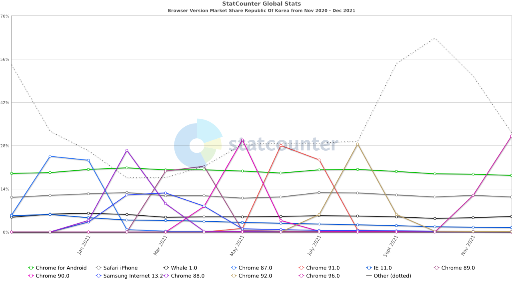

# Chapter 01. 자바스크립트 개요와 개발환경 설정

## 01-1 자바스크립트의 활용

* 2021년 11월 ~ 12월 한국 브라우저 점유율
  
  
  1. 크롬 96.0
      * 31.09%
  2. 크롬 (안드로이드용)
      * 18.37%
  3. 사파리 (아이폰용)
      * 11.35%
  4. 삼성 인터넷 16.0
      * 10.69%
  5. MS Edge 96
      * 7.2%
  6. 네이버 Whale 1.0
      * 5.07%
  
  
  
  
  ##### [통계 CSV 파일](browser_version-KR-monthly-202011-202112.csv)의 12월자 IE에 대한 상세 정보
  
  * IE 11
    * 1.39 %
  * IE 9
    * 0.02%
  * IE 8
    * 0.01%
  * IE 10은 Other에 포함된 듯 (1.05%)
  
  
  
  출처: https://gs.statcounter.com/browser-version-market-share/all/south-korea


## 01-2 개발환경 설치와 코드 실행

* 개발환경 프로그램
  * Visual Studio Code
  * 크롬 


* 크롬 개발자 도구 들어가기 단축키
  * Ctrl + Shift + I


#### VSCode Live Server 확장 설치

* https://marketplace.visualstudio.com/items?itemName=ritwickdey.LiveServer

* 설치 후 기본 브라우저를 크롬으로 변경해주자!

```javascript
// LiveServer 기본 브라우저 설정
"liveServer.settings.CustomBrowser": "chrome",
```


#### 자바 스크립트 표준 스타일

* https://standardjs.com/readme-kokr.html
  * 탭은 공백 2칸, 문자열은 작은 따옴표로 감싸기 등등


## 의견

이전회사에서 IE 8, 9 구버전 호환성 맞추는 일이 꽤 힘든 일이였는데, 현시점 통계를 보니, IE 11도 이제 지원을 안해도 될 것 같은 추세인 것 같다.

그런데, 생각보다 Firefox 사용이 낮이 편이다.

